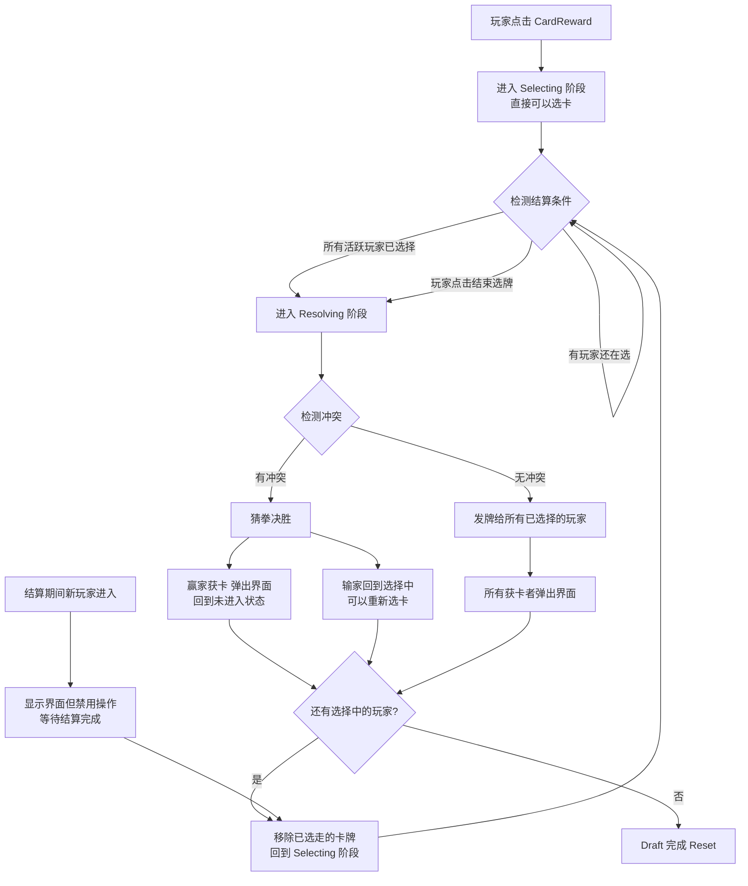
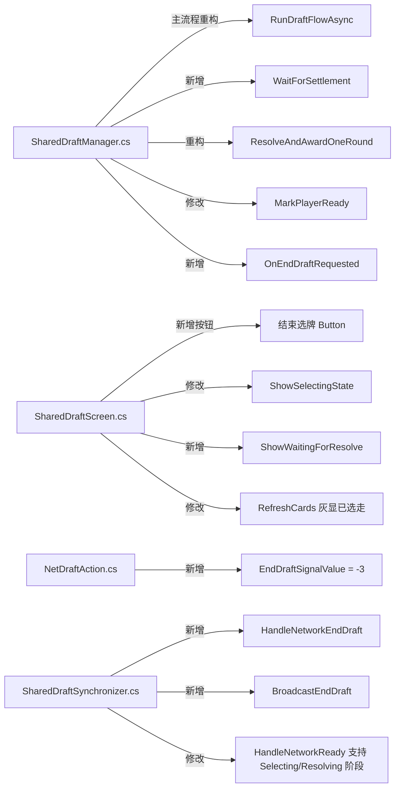

## 产品概述

重构 STS2 SharedDraft mod 的核心选牌-结算流程，从现有的"等待所有人进入 -> 统一选卡 -> 统一结算 -> 统一发牌"模式，改为更灵活的"进入即选卡 -> 多轮结算循环"模式。v0.21.0 作为回退基准版本。

## 核心功能

### 1. 三态玩家状态机

- 未进入 (NotEntered)：默认状态，玩家未点击 CardReward 按钮
- 选择中 (Selecting)：玩家点击 CardReward 进入共享选牌池，可以直接选卡，无需等待
- 已选择 (Selected)：玩家锁定了卡牌选择，等待结算

### 2. 进入即选卡

- 玩家点击 CardReward 后立即进入选择中状态，可以直接开始选卡
- 移除现有的 60 秒等待超时和等待界面
- 不需要等待其他玩家进入

### 3. 结算触发

- 自动触发：当所有玩家都进入"已选择"状态时自动开始结算
- 强制触发：界面右下角新增"结束选牌"按钮，任何已进入界面的玩家均可点击，立即开始结算（只结算已选择的玩家，未进入/未选择的不参与本轮）

### 4. 冲突解决与多轮循环

- 无冲突：直接发牌，玩家获卡后弹出界面，回到未进入状态
- 有冲突：猜拳决胜 — 赢家获卡并弹出界面回到未进入状态；输家回到选择中状态可重新选卡
- 结算后移除已被选走的卡牌，后续不可再选
- 输家（及新进入的玩家）重选后，等所有选择中的玩家都锁定即再次结算，循环直到完成

### 5. 结算期间保护

- 结算进行中如有玩家进入，显示界面但禁用操作
- 结算完成后自动解锁为选择中状态

### 6. 跳过选卡

- 所有阶段保留"跳过选卡"按钮（含输家重选阶段）
- 点击后玩家不获取任何卡牌，标记为已完成

## 技术栈

- 语言：C# (.NET 9.0)
- 游戏引擎：Godot 4 (GDExtension)
- Mod 框架：HarmonyLib (Harmony patching)
- 网络同步：自定义 DraftGameAction / NetDraftAction (INetAction + ActionQueueSynchronizer)
- UI：Godot Control 节点手动构建（无场景文件）

## 实现方案

### 核心思路

将现有的线性流程 `WaitForReady -> Selecting -> Resolving -> Awarding -> Complete` 重构为一个**可重入的结算循环**：`Selecting <-> Resolving/Awarding`。核心变化是：

1. 移除 `WaitingForReady` 阶段，玩家进入后直接进入 `Selecting`
2. `ResolveConflicts` 改造为每次只处理一轮冲突，赢家立即发牌退出，输家回到 Selecting
3. `RunDraftFlowAsync` 改为循环结构，在 Selecting 和 Resolving 之间反复切换直到所有人完成
4. 新增 `EndDraftSignalValue` 网络信号用于广播"结束选牌"操作

### 关键技术决策

**1. PlayerDraftState 状态扩展**

在现有 `PlayerDraftState` 类中新增 `IsCompleted` 属性（标记已获卡退出或跳过的玩家），利用已有的 `IsReady`（是否进入界面）、`HasSelected`（是否锁定选卡）、`IsOptedOut`（是否跳过）组合表达三态：

- 未进入: `!IsReady && !IsCompleted`
- 选择中: `IsReady && !HasSelected && !IsCompleted`  
- 已选择: `IsReady && HasSelected && !IsCompleted`
- 已完成: `IsCompleted`（获卡退出或跳过）

不需要新增枚举类型，复用现有字段加一个 `IsCompleted` 布尔即可。

**2. DraftPhase 状态机调整**

移除 `WaitingForReady` 阶段的使用（保留枚举值避免编译问题），新增阶段流转：

```
Collecting -> Selecting <-> Resolving -> Awarding -> 回到 Selecting 或 Complete
```

**3. RunDraftFlowAsync 重构为循环**

核心流程改为：

```
1. BeginSync + 进入 Selecting（跳过 WaitForAllReady）
2. LOOP:
   a. WaitForSettlement(ct) -- 等待触发条件：所有活跃玩家已选择 OR 收到"结束选牌"信号
   b. TransitionTo(Resolving) -- 锁定界面
   c. ResolveAndAwardOneRound(ct) -- 处理冲突+发牌给赢家和无冲突玩家
   d. 移除已选走的卡牌
   e. 将输家/新加入玩家设为 Selecting
   f. 检查：如果没有活跃的 Selecting 玩家 -> break
   g. TransitionTo(Selecting) -- 解锁界面给剩余玩家
3. Complete + Reset
```

**4. 结算期间保护**

`MarkPlayerReady()` 在 Resolving/Awarding 阶段接收 ready 信号时，将玩家标记为 `IsReady` 但不解锁 UI（界面显示"等待结算中"）。结算完成回到 Selecting 时统一解锁。

**5. "结束选牌"网络同步**

新增 `DraftGameAction.EndDraftSignalValue = -3`，通过现有 DraftGameAction/NetDraftAction 机制广播。收到后在 `SharedDraftSynchronizer` 中设置一个标志 `_endDraftRequested = true`，`WaitForSettlement` 检测到该标志后立即触发结算。

**6. 赢家独立退出（关键变更）**

现有 `AwardCards` 是统一对所有人发牌后一起退出。新逻辑需要：

- 对本地赢家：立即调用 `AwardCardToLocalPlayer` + `SharedDraftScreen.Hide()`
- 对远程赢家：标记 `IsCompleted`，远端客户端各自处理自己的退出
- 本地输家：`SharedDraftScreen.EnableReSelection()` 恢复选卡能力
- 不再统一 `SharedDraftScreen.Hide()`，而是每个赢家独立退出

**7. 卡池缩减**

每轮结算后，将已发牌的 DraftId 从 `_draftPool` 标记为不可选（新增 `IsAwarded` 字段到 `DraftCard`，或维护一个 `_awardedDraftIds` HashSet）。UI 刷新时灰显/隐藏这些卡。

## 实现细节

### 性能注意

- `WaitForSettlement` 循环使用 100ms 间隔轮询（与现有 `WaitForAllSelections` 一致）
- 多轮结算循环有 maxRounds=10 安全上限（沿用现有设计）
- 卡池标记采用 HashSet<int> 而非从 List 移除，避免频繁列表重建

### 日志

- 复用现有 `ModEntry.Logger`，新增日志点覆盖结算循环、赢家退出、输家重选等关键路径
- 日志级别沿用 Info + Error 模式

### 向后兼容

- `DraftPhase.WaitingForReady` 枚举值保留但不再使用，避免破坏任何序列化或比较
- `SharedDraftConfig.ReadyTimeoutSeconds` 配置项保留但不再生效
- 网络协议向后兼容：新的 `EndDraftSignalValue = -3` 不会与已有的 ReadySignalValue(-1)、OptOutSignalValue(-2) 冲突

### 爆炸半径控制

- 不修改 Patches/RewardsPatch.cs（CardReward.OnSelect 拦截逻辑不变）
- 不修改 Patches/LifecyclePatch.cs
- 不修改 NetDraftCardExchangeAction.cs（卡牌数据交换逻辑不变）
- 不修改 ModEntry.cs、ModConfigBridge.cs
- DraftResultOverlay.cs 基本不变（仅调用方式从内部循环改为外部调用）

## 架构设计

### 重构后的流程图



### 模块变更关系



## 目录结构

```
SharedDraft/
├── SharedDraftManager.cs       # [MODIFY] 核心重构：移除 WaitForAllReady，重构 RunDraftFlowAsync 为循环结构，
│                                #   新增 WaitForSettlement、ResolveAndAwardOneRound、OnEndDraftRequested，
│                                #   修改 MarkPlayerReady 支持 Selecting/Resolving 阶段接收 ready，
│                                #   PlayerDraftState 新增 IsCompleted 属性，
│                                #   新增 _awardedDraftIds HashSet 跟踪已选走卡牌，
│                                #   修改 AwardCards 改为单轮发牌（只处理赢家和无冲突者），
│                                #   修改 ResolveConflicts 改为单轮处理（不内部循环重选）
│
├── UI/SharedDraftScreen.cs     # [MODIFY] UI 调整：移除等待倒计时 UI，
│                                #   新增"结束选牌"按钮（BuildBottomSection 中添加），
│                                #   新增 ShowWaitingForResolve 状态（显示界面但禁用操作），
│                                #   修改 ShowSelectingState 直接进入可选卡状态，
│                                #   修改 RefreshCards 灰显已被选走的卡牌（通过 _awardedDraftIds），
│                                #   修改 RefreshPlayerStatus 适配新三态显示
│
├── NetDraftAction.cs           # [MODIFY] 新增 EndDraftSignalValue = -3 常量，
│                                #   DraftGameAction.ExecuteAction 新增对 -3 的处理分支
│
├── SharedDraftSynchronizer.cs  # [MODIFY] 新增 BroadcastEndDraft 方法广播结束选牌信号，
│                                #   新增 HandleNetworkEndDraft 处理接收到的结束信号，
│                                #   新增 _endDraftRequested 标志，
│                                #   修改 HandleNetworkReady 支持在 Selecting/Resolving 阶段接收 ready 信号
│
├── SharedDraftConfig.cs        # [MODIFY] ReadyTimeoutSeconds 标记为废弃但保留配置项避免破坏兼容性
│
├── Patches/RewardsPatch.cs     # [不修改]
├── Patches/LifecyclePatch.cs   # [不修改]
├── UI/DraftResultOverlay.cs    # [不修改]
├── NetDraftCardExchangeAction.cs # [不修改]
├── ModEntry.cs                 # [不修改]
└── ModConfigBridge.cs          # [不修改]
```

## Agent Extensions

### SubAgent

- **code-explorer**
- 目的：在实现各个步骤时，用于搜索 SharedDraftManager.cs 和 SharedDraftScreen.cs 中的具体方法位置和调用关系，确保修改准确
- 预期结果：准确定位每个需要修改的方法的起止行号和依赖关系