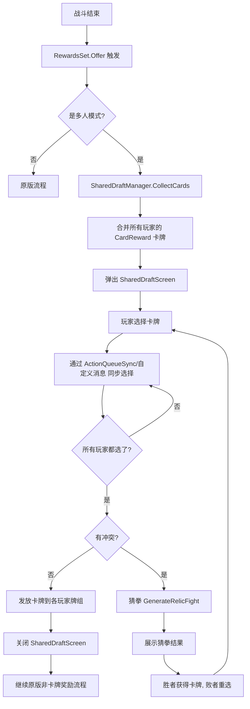

## 产品概述

SharedDraft 是一个杀戮尖塔2（Slay the Spire 2）多人模式 mod，将战斗后各玩家独立的卡牌奖励环节改为"共享选卡"模式。战斗结束后，所有玩家各自的可选卡牌会被合并到同一个屏幕上展示，每位玩家从合并后的卡池中各选一张；当所有人都选定后统一结算。如果多位玩家选中同一张卡牌，则调用游戏已有的"猜拳"（Rock/Paper/Scissors）机制决定归属，失败者重新选择。

## 核心功能

1. **卡牌奖励合并**：战斗结束后（普通/精英/Boss），拦截每个玩家的 CardReward 生成流程，收集所有玩家各自的可选卡牌（CardModel），将它们合并为一个统一的共享卡池在同一个自定义 UI 中展示
2. **共享选卡界面**：用自定义 CanvasLayer + 卡牌网格替代原生 NCardRewardSelectionScreen，卡片按照所属角色卡池分组/标色展示，允许每位玩家点击选中一张；界面右侧或底部显示各玩家投票状态（已选/未选），所有人选定后统一进入结算
3. **冲突检测与猜拳解决**：结算时检测是否有多位玩家选中同一张卡牌；如有冲突，复用游戏内 `RelicPickingResult.GenerateRelicFight()` 的猜拳逻辑（Rock/Paper/Scissors）决定卡牌归属；猜拳失败者需要重新选择
4. **卡牌发放**：猜拳全部结束、每位玩家最终确定卡牌后，将卡牌添加到各玩家牌组，调用原版同步 API 通知其他客户端
5. **调试模式**：支持单人模式下通过 config.json 的 DebugMode 模拟多个虚拟玩家的选卡行为，便于测试

## 技术栈

- **SDK**：Godot.NET.Sdk/4.5.1 + `DisableImplicitGodotGeneratorReferences=true`（与 GoldGift/StartingGold 一致）
- **补丁框架**：Harmony（0Harmony.dll），仅 patch 纯 C# 方法
- **API 访问**：BepInEx.AssemblyPublicizer 将 sts2.dll internal 成员编译时公开
- **语言**：C# / .NET 9.0
- **UI**：Godot 动态节点构建（CanvasLayer, PanelContainer, GridContainer 等），通过 CallDeferred 安全注入

## 实现方案

### 整体策略

采用 **Harmony Postfix 拦截 + 自定义 UI 覆盖 + 游戏内猜拳复用** 的方案：

1. 在 `RewardsSet.Offer()` 方法的 Prefix 中拦截战后奖励流程，收集所有玩家的 CardReward 对象中的卡牌
2. 抑制原版的 NCardRewardSelectionScreen 弹出（通过标记跳过），改为弹出自定义的 SharedDraftScreen
3. SharedDraftScreen 展示合并后的所有卡牌，允许本地玩家点击选择
4. 通过 ActionQueueSynchronizer（或自定义消息）同步各玩家的选择到所有客户端
5. 全员选定后执行冲突检测，复用 `RelicPickingResult.GenerateRelicFight()` 进行猜拳
6. 猜拳失败者重新选择，直到无冲突
7. 最终调用 `Player.RunState.AddCard()` + `RewardSynchronizer.SyncLocalObtainedCard()` 将卡牌添加到各玩家牌组

### 关键技术决策

**1. Hook 点选择：`RewardsSet.Offer()` 的 Prefix**

理由：`Offer()` 是纯 C# async 方法，在所有 Reward 生成（`GenerateWithoutOffering()`）完成后、向玩家展示奖励屏幕之前被调用。在此处拦截可以：

- 获取到已经 `Populate()` 完成的 CardReward 列表（卡牌已生成）
- 抑制原版的逐个奖励展示流程，改为我们的共享流程
- 不影响金币、药水、遗物等非卡牌奖励的正常流程

**2. 多人同步：基于 `ActionQueueSynchronizer`**

复用游戏已有的 `ActionQueueSynchronizer`（TreasureRoomRelicSynchronizer 也使用此机制），优势：

- 确保多人操作顺序一致（确定性）
- 自动处理 Host/Client 消息路由
- 不需要自己实现底层网络消息

具体做法：定义 `SharedDraftPickAction : AbstractGameAction`，当本地玩家选卡时，通过 `_actionQueueSynchronizer.RequestEnqueue(action)` 提交选择，其他客户端收到后更新投票状态。

如果 ActionQueueSynchronizer 的接入复杂度过高（涉及多个 internal 依赖），退化方案是直接通过 `INetGameService.SendMessage<T>()` 自定义消息类型通信。

**3. 猜拳逻辑复用**

直接调用 `RelicPickingResult.GenerateRelicFight(List<Player>, RelicModel, Func<RelicPickingFightMove>)` 的同构方法。由于该方法是为 RelicModel 设计的，卡牌场景下需做适配：

- 将竞争同一卡牌的玩家列表传入
- 使用游戏的 Rng 或我们自己的确定性随机源生成猜拳手势
- 从返回的 RelicPickingResult.fight 中提取胜者
- 在 UI 上展示猜拳动画（可简化为文字/图标提示）

**4. 卡牌来源标识**

合并卡池后需标识每张卡的来源角色（哪个玩家的卡池），用于：

- UI 上按角色分组/标色展示
- 结算时将未被选择的卡牌正确回到原玩家的"跳过"记录
- 用 `Dictionary<CardModel, int>` 映射（cardModel -> playerSlotIndex）

**5. 单人调试模式**

沿用 GoldGift 的 DebugMode 模式，虚拟玩家的选卡行为用简单 AI 模拟（随机选择一张尚未被选的卡牌），延迟 1-2 秒模拟思考时间。

### 性能与风险控制

- 卡牌合并仅在战斗结束时发生（低频），不影响战斗性能
- UI 注入使用 CallDeferred，避免 Godot 生命周期冲突
- 绝不 patch `_Ready()`、`_Process()` 等 Godot 生命周期方法
- 非多人模式（单人且非调试）下完全不干预，零开销
- 如果 mod 初始化失败，原版奖励流程正常 fallback

## 实现注意事项

1. **Harmony 安全**：所有 patch 目标必须是纯 C# 方法。`RewardsSet.Offer()` 是 `async Task` 方法，Harmony Prefix 可以安全拦截并通过返回 `false` 跳过原始方法。但需确保 Prefix 返回 false 时自行处理 await 链。更安全的做法是让 Prefix 设置一个标志位，在 `CardReward.OnSelect()` 的 Prefix 中检查并重定向。
2. **竞态控制**：多人同步中，所有客户端必须使用相同的随机种子进行猜拳，确保结果一致。可以从 RunManager 的 Rng 获取或使用固定种子。
3. **向后兼容**：mod 的存在不应改变单人模式的任何行为；如果多人模式中只有一个玩家安装了此 mod，应 gracefully fallback 到原版流程。
4. **卡牌所有权**：每位玩家只能从合并卡池中选一张，且不能超过自己原本应得的奖励数量（通常是1张）。

## 架构设计



## 目录结构

```
SharedDraft/
├── SharedDraft.sln                # [NEW] VS 解决方案文件
├── SharedDraft.csproj             # [NEW] 项目文件，复用 GoldGift 的 SDK/编译/部署配置模式
├── SharedDraft.json               # [NEW] Mod manifest（id=SharedDraft, has_dll=true, has_pck=false）
├── project.godot                  # [NEW] Godot 项目文件（最小配置）
├── config.json                    # [NEW] 运行时配置（DebugMode, DebugPlayerCount 等）
├── ModEntry.cs                    # [NEW] Mod 入口。[ModInitializer] 标记，加载配置，执行 Harmony.PatchAll()
├── SharedDraftConfig.cs           # [NEW] 配置管理。从 config.json 加载 DebugMode、DebugPlayerCount 等设置，参照 GoldGiftConfig 模式
├── SharedDraftManager.cs          # [NEW] 核心逻辑管理器。负责收集各玩家 CardReward 卡牌、管理选卡状态机（等待选择/检测冲突/猜拳/发放）、协调 UI 和同步
├── SharedDraftSynchronizer.cs     # [NEW] 多人同步处理。封装选卡消息的发送/接收，管理各客户端的投票状态，调试模式下模拟虚拟玩家的选择行为
├── Patches/
│   ├── RewardsPatch.cs            # [NEW] Harmony 补丁。拦截 RewardsSet.Offer() 收集 CardReward、拦截 CardReward.OnSelect() 重定向到共享流程。所有目标均为纯 C# 方法
│   └── LifecyclePatch.cs          # [NEW] 生命周期补丁。patch RunManager.CleanUp/AbandonInternal 重置 mod 状态，参照 GoldSyncPatch 模式
└── UI/
    ├── SharedDraftScreen.cs       # [NEW] 共享选卡 UI。CanvasLayer 全屏覆盖，展示合并后的卡牌网格（按角色卡池分组标色）、各玩家投票状态指示器、选卡确认按钮
    └── DraftResultOverlay.cs      # [NEW] 猜拳结果展示 UI。展示冲突卡牌、参与猜拳的玩家、每轮出招（Rock/Paper/Scissors 图标）、最终胜者，带简单动画效果
```

## 关键代码结构

```
/// <summary>
/// 代表合并卡池中的一张卡牌及其来源信息
/// </summary>
public record DraftCard
{
    /// <summary>游戏内卡牌模型</summary>
    public required CardModel Card { get; init; }
    /// <summary>原始所属玩家的 slot index</summary>
    public required int OwnerPlayerSlot { get; init; }
    /// <summary>在原始 CardReward 中的索引</summary>
    public required int OriginalIndex { get; init; }
    /// <summary>全局唯一 draft ID（用于多人同步）</summary>
    public required int DraftId { get; init; }
}

/// <summary>
/// 选卡状态机的状态
/// </summary>
public enum DraftPhase
{
    Inactive,       // 未激活
    Collecting,     // 正在收集各玩家卡牌
    Selecting,      // 玩家正在选择
    Resolving,      // 正在解决冲突（猜拳）
    Awarding,       // 正在发放卡牌
    Complete        // 完成
}
```

## Agent Extensions

### SubAgent

- **code-explorer**
- 用途：在实现各步骤时，需要反编译 sts2.dll 中的关键方法（RewardsSet.Offer、CardReward.OnSelect、ActionQueueSynchronizer 等）来确认精确的方法签名和调用约定
- 预期结果：获取精确的游戏 API 签名和内部实现细节，确保 Harmony patch 目标正确、同步消息格式兼容