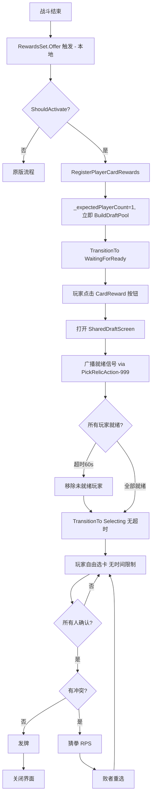

## 产品概述

修复 SharedDraft mod 在多人模式下玩家无法进入共享选卡池的核心 Bug，并新增"就绪等待"机制以正确处理玩家异步点击选卡包的场景。

## 核心功能

1. **修复收集阶段卡死**：当前 `BeginCollecting` 在多人模式下设置 `_expectedPlayerCount = players.Count`，但 `RewardsSet.Offer` 的 Harmony Prefix 只在本地客户端触发，导致 `_collectedRewards.Count` 永远只有 1，状态机卡在 Collecting 阶段。修复为利用确定性共识原理，本地 Offer 触发时直接构建完整卡池
2. **新增"等待就绪"阶段**：玩家点击选卡包按钮后进入 SharedDraftScreen 并广播就绪信号。界面上显示各玩家就绪状态（已进入/等待中），等待阶段有 60 秒超时保护。超时后未进入的玩家视为跳过，已进入的玩家正常选卡
3. **超时仅限等待阶段**：所有人进入选卡界面后进入 Selecting 阶段，此阶段无任何时间限制，玩家可以自由浏览和选择卡牌
4. **选卡完成统一结束**：所有已就绪玩家确认选择后统一进入冲突检测、猜拳解决、发牌流程，然后关闭界面

## 技术栈

- SDK：Godot.NET.Sdk/4.5.1 + C# / .NET 9.0
- 补丁框架：HarmonyLib（0Harmony.dll）
- UI：Godot 动态节点构建（CanvasLayer, PanelContainer 等）
- 网络同步：复用 PickRelicAction 编码机制（DraftIdEncodingOffset = 1000）

## 实现方案

### 整体策略

分三步修复：(1) 修复收集逻辑使卡池能正确构建；(2) 新增 WaitingForReady 阶段处理异步点击；(3) 区分超时逻辑——等待阶段有超时，选卡阶段无超时。

### 关键技术决策

**1. 收集阶段：_expectedPlayerCount 统一改为 1**

所有客户端使用相同种子（确定性共识），`RewardsSet.Offer` 只在本地触发。将 `BeginCollecting` 的非 Debug 分支也改为 `_expectedPlayerCount = 1`，本地 Offer 一触发就立即调用 `BuildDraftPool()`。在 `BuildDraftPool` 中，利用确定性复制为所有远端玩家生成卡池条目（复用现有 DebugMode 的复制逻辑，扩展到真实多人场景）。

**2. 状态机新增 WaitingForReady 阶段**

在 `DraftPhase` 枚举中新增 `WaitingForReady` 值。流程变为：

```
Inactive → Collecting → WaitingForReady → Selecting → Resolving → Awarding → Complete → Inactive
```

- `Collecting → WaitingForReady`：本地 Offer 触发后卡池构建完成，切换到 WaitingForReady
- `WaitingForReady → Selecting`：所有玩家就绪或超时后切换
- WaitingForReady 期间有 60 秒超时
- Selecting 阶段无任何超时

**3. 就绪信号同步：复用 PickRelicAction 编码**

定义就绪信号的编码：使用特殊 DraftId = -1，编码后 `encodedIndex = 999`（1000 + (-1)）。在 `TryInterceptPickRelicAction` 中识别 999 为就绪信号，调用 `SharedDraftManager.MarkPlayerReady(playerSlot)`。

**4. 超时策略精确化**

- `WaitForAllReady()` 方法：60 秒超时，超时后将未就绪的玩家标记为 opted-out，从 `_playerStates` 中移除或忽略
- `WaitForAllSelections()` 方法：移除原有的 120 秒超时，改为无限等待（仅在所有已就绪玩家选完后结束）
- DebugMode 下就绪阶段直接跳过（虚拟玩家自动就绪）

**5. CardRewardOnSelectPatch 触发逻辑调整**

当前逻辑是检查 `HasRegisteredRewards()` 后调用 `HandleCardRewardSelect()`。修改为：

- 如果 DraftPool 已构建但尚未进入 WaitingForReady → 切换状态并广播就绪
- 如果已在 WaitingForReady/Selecting → 直接打开 SharedDraftScreen

### 性能与风险控制

- 收集阶段改动向后兼容：DebugMode 下逻辑不变（已经是 `_expectedPlayerCount = 1`）
- 就绪信号编码 999 不与正常 DraftId 冲突（DraftId 从 0 开始递增，通常 < 20）
- WaitingForReady 超时后 graceful fallback，不影响已就绪玩家
- 所有改动不影响单人模式（`ShouldActivate()` 返回 false 时完全不干预）

## 实现注意事项

1. **`BuildDraftPool` 扩展**：当前非 Debug 模式的 else 分支只从 `_collectedRewards` 中读取。由于改为 `_expectedPlayerCount = 1` 后只有本地玩家的 rewards，需要在此分支中也加入类似 Debug 模式的卡池复制逻辑（为每个远端玩家复制卡牌条目），否则合并卡池中只有一个玩家的卡
2. **`InitializePlayerStates` 需保持不变**：即使 `_expectedPlayerCount = 1`，`_playerStates` 应包含所有真实玩家（用于 UI 显示和选卡逻辑），不要把 playerStates 数量和 expectedPlayerCount 混淆
3. **就绪信号的自触发**：本地玩家通过 ActionQueueSynchronizer 广播的就绪信号会同时回到本地（PickRelicAction.ExecuteAction 会对所有客户端执行），需在 `TryInterceptPickRelicAction` 中正确处理本地/远端区分
4. **WaitForAllReady 中的超时 UI 更新**：需在 SharedDraftScreen 中显示倒计时，每秒更新一次

## 架构设计



## 目录结构

```
SharedDraft/
├── SharedDraftManager.cs          # [MODIFY] 核心状态机改造。新增 DraftPhase.WaitingForReady 枚举值；BeginCollecting 中统一设 _expectedPlayerCount=1；BuildDraftPool 扩展非 Debug 分支的多玩家卡池复制逻辑；新增 MarkPlayerReady(int playerSlot) 方法；新增 WaitForAllReady() 异步方法（60s 超时+UI更新）；RunDraftFlowAsync 中插入 WaitingForReady 阶段；WaitForAllSelections 移除超时限制；新增 _readyPlayers HashSet 和 _readyTimeoutSeconds 字段；新增 PlayerDraftState.IsReady 属性
├── SharedDraftSynchronizer.cs     # [MODIFY] 同步器添加就绪信号支持。新增 BroadcastReady() 方法（编码就绪信号为 PickRelicAction relicIndex=999）；TryInterceptPickRelicAction 中识别 encodedIndex=999 为就绪信号，调用 Manager.MarkPlayerReady；新增 ReadySignalReceived 事件；编码常量 ReadySignalEncodedValue = 999
├── Patches/RewardsPatch.cs        # [MODIFY] Harmony 补丁调整。CardRewardOnSelectPatch.Prefix 中调整逻辑：当 Phase 为 WaitingForReady 或 Selecting 时拦截并打开 SharedDraftScreen + 广播就绪信号；HandleCardRewardSelect 中处理首次进入 WaitingForReady 的场景
├── UI/SharedDraftScreen.cs        # [MODIFY] UI 添加等待就绪状态。Show 方法支持 WaitingForReady 模式：显示"等待其他玩家加入"提示和倒计时；玩家状态侧栏显示就绪/等待图标；新增 ShowWaitingState()/ShowSelectingState() 切换方法；新增 UpdateCountdown(int secondsLeft) 方法；WaitingForReady 期间禁用卡牌点击和确认按钮，全部就绪后启用
├── SharedDraftConfig.cs           # [MODIFY] 配置添加就绪超时。新增 ReadyTimeoutSeconds 属性（默认60）；ConfigData 新增对应字段；LoadConfig/WriteDefaultConfig 中处理新字段
└── Patches/LifecyclePatch.cs      # [无需修改] 已有的 Reset 调用链可正确处理新增状态
```

## 关键代码结构

```
public enum DraftPhase
{
    Inactive,
    Collecting,
    WaitingForReady,   // 新增：等待所有玩家进入选卡界面
    Selecting,         // 所有人就绪后进入，无时间限制
    Resolving,
    Awarding,
    Complete
}

public class PlayerDraftState
{
    // ... 现有属性 ...
    
    /// <summary>该玩家是否已进入共享选卡界面（就绪）</summary>
    public bool IsReady { get; set; } = false;
    
    /// <summary>该玩家是否因超时被标记为跳过</summary>
    public bool IsOptedOut { get; set; } = false;
}
```

## Agent Extensions

### SubAgent

- **code-explorer**
- 用途：在实现各步骤时，需要探索 sts2.dll 中 PickRelicAction、ActionQueueSynchronizer、TreasureRoomRelicSynchronizer 的精确字段名和方法签名，确保 Harmony patch 和反射访问正确
- 预期结果：获取精确的游戏 API 签名，确保就绪信号编码/解码和 PickRelicAction 拦截逻辑正确